# StretchCeilings

В данном репозитории содержится приложение, реализирующее упрощение работы бизнеса по установке натяжных потолков.
Приложенние было разработанно на основе данных [UML-диаграм](https://github.com/romankravchuk/uml_diagrams).

# Пользовательский интерфейс

## 1. Форма связанные с дополнительными услугами

### 1.1 Форма просмотра информации дополнительной услуги

> **Изменить** данные можно только пользователь с правами на **изменение** дополнительной услуги.

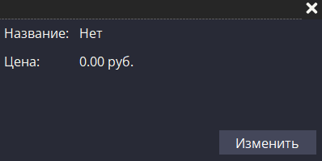

### 1.2 Форма изменения информации дополнительной услуги

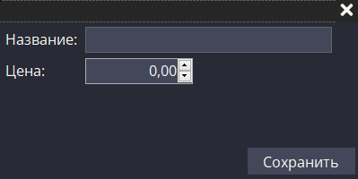

### 1.3 Форма взаимодействия со списком дополнительных услуг

> **Добавлять/удалять** элементы из списка может только пользователь с правами на **добавление/удаления**
дополнительной услуги.

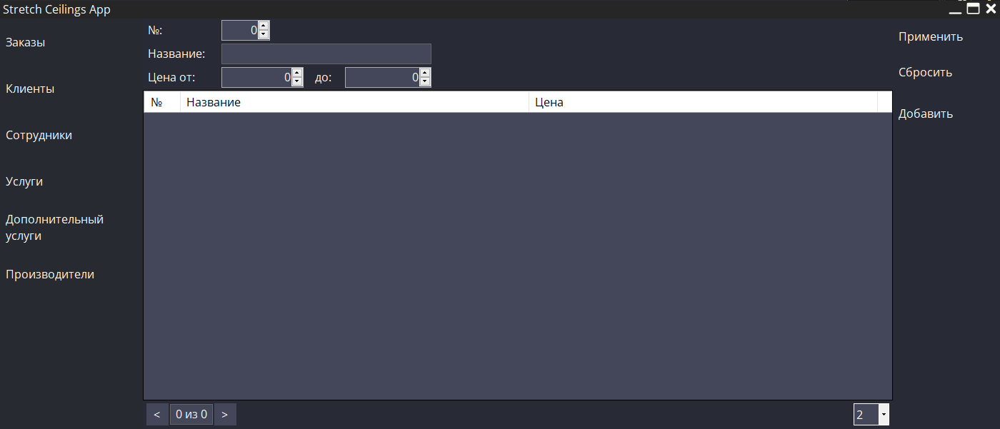

## 2. Формы связанные с клиентами

### 2.1 Форма просмотра информации клиента

> **Изменить** данные можно только пользователь с правами на **изменение** клиента.

### 2.2 Форма изменения информации клиента

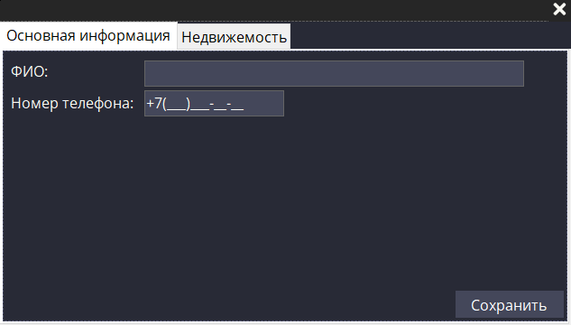

### 2.3 Форма изменения информации клиента
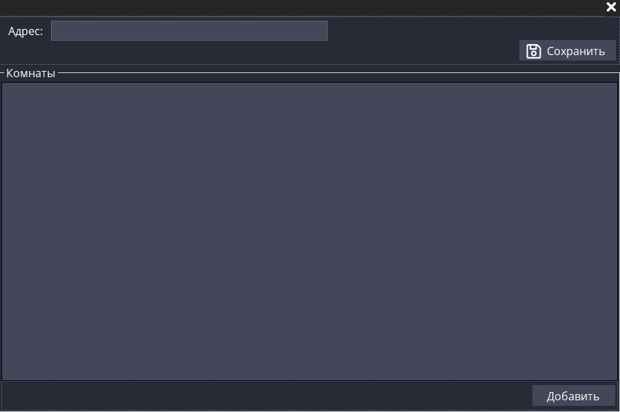

### 2.4 Форма изменения информации клиента
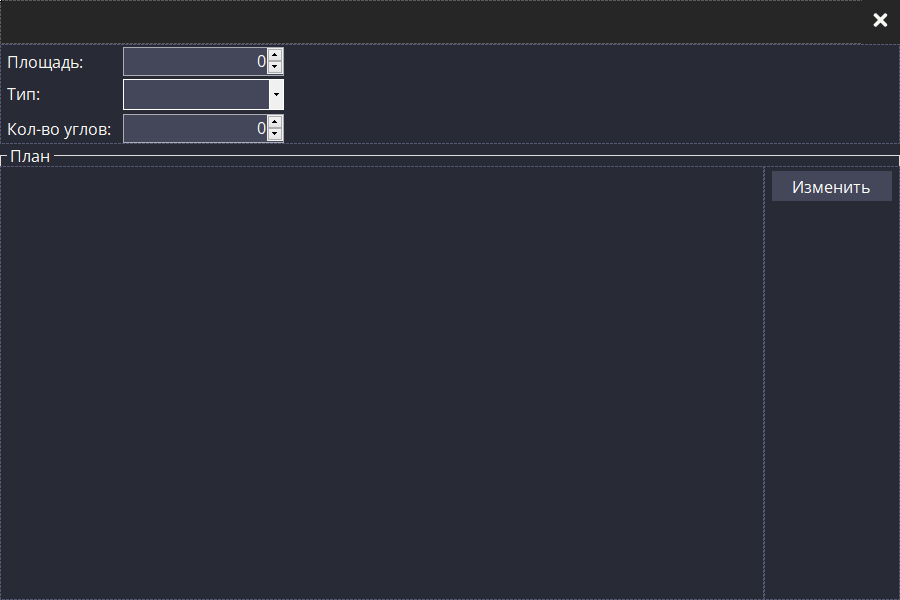

### 2.5 Форма взаимодействия со списком клиентов

> **Добавлять/удалять** элементы из списка может только пользователь с правами на **добавление/удаления** клиента.

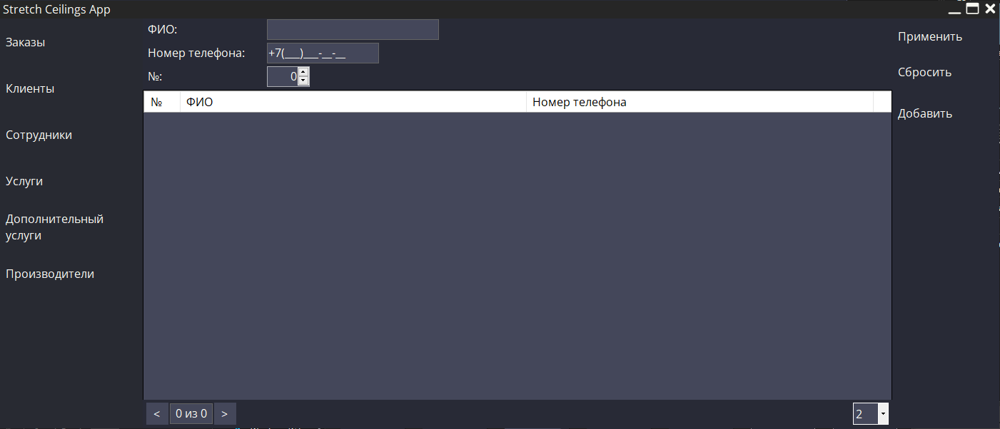

## 3. Формы связанные с заказами

### 3.1 Форма просмотра информации заказа

> **Изменить** данные можно только пользователь с правами на **изменение** заказа.

### 3.2 Форма изменения информации заказа

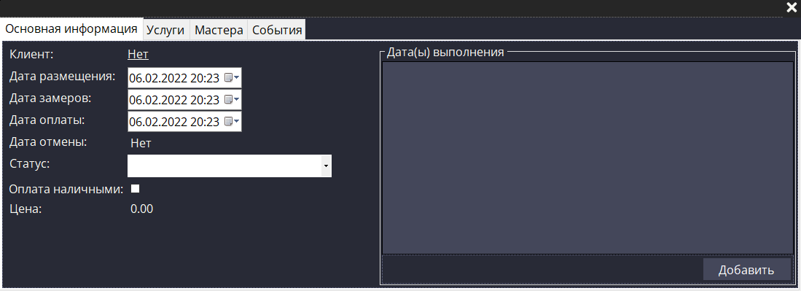

### 3.3 Форма взаимодействия со списком заказов

> **Добавлять/удалять** элементы из списка может только пользователь с правами на **добавление/удаления** заказа.

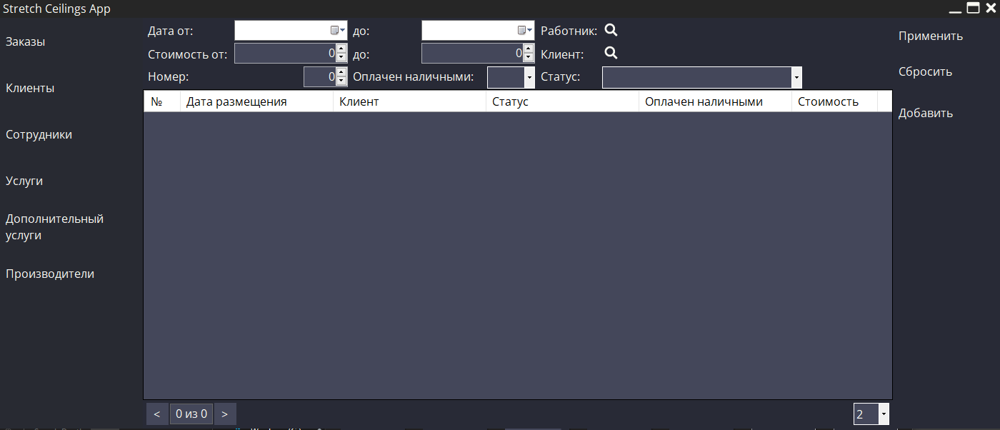

## 4. Формы связанные с сотрудниками

> **Изменить** данные можно только пользователь с правами на **изменение** сотрудника.

### 4.1 Форма просмотра информации дсотрудника

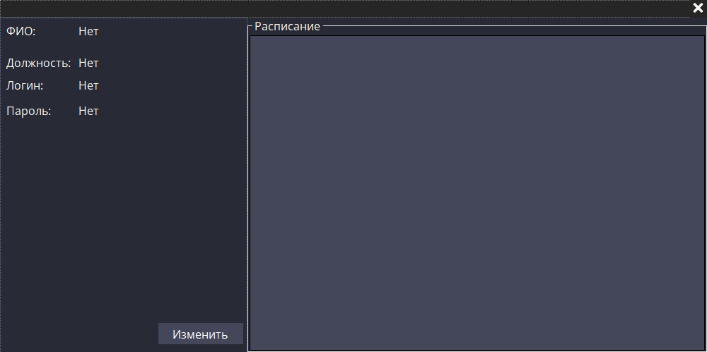

### 4.2 Форма изменения информации сотрудника

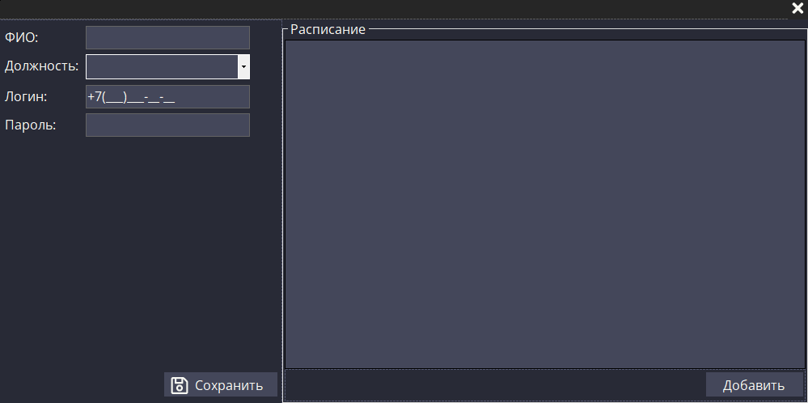

### 4.4 Форма взаимодействия со списком сотрудников

> При нажатии `Повторить` становится доступна область для повторения дней и недель, чтобы можно было добавить сразу несколько дат 

### 4.4 Форма взаимодействия со списком сотрудников

> **Добавлять/удалять** элементы из списка может только пользователь с правами на **добавление/удаления** сотрудника.

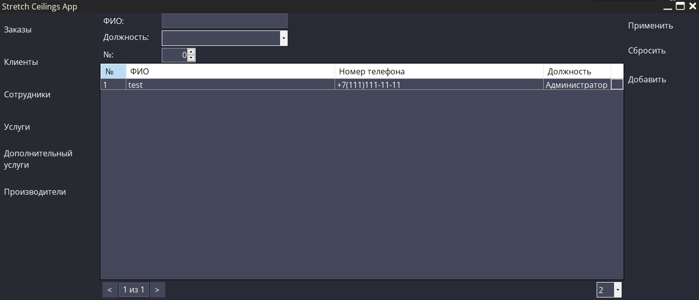

## 5. Формы связанные с услугами

> **Изменить** данные можно только пользователь с правами на **изменение** услуги.

### 5.1 Форма просмотра информации услуги

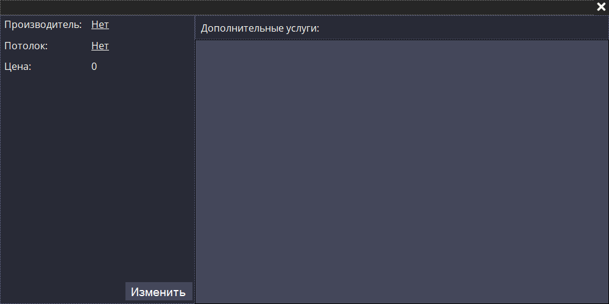

### 5.2 Форма изменения информации услуги

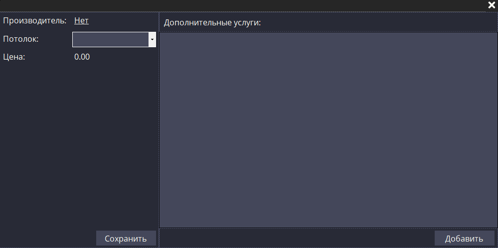

### 5.3 Форма взаимодействия со списком услуг

> **Добавлять/удалять** элементы из списка может только пользователь с правами на **добавление/удаления**
услуги.

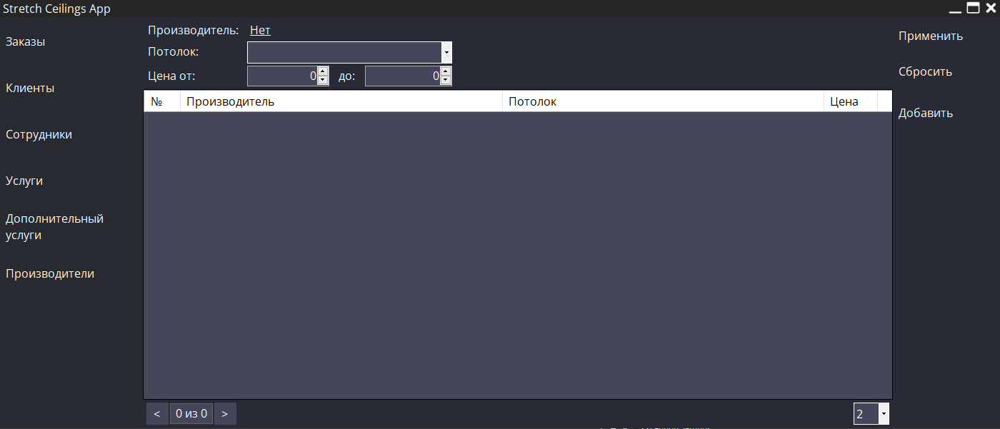

## 6. Формы связанные с производителями

> **Изменить** данные можно только пользователь с правами на **изменение** производителя.

### 6.1 Форма просмотра информации производителя

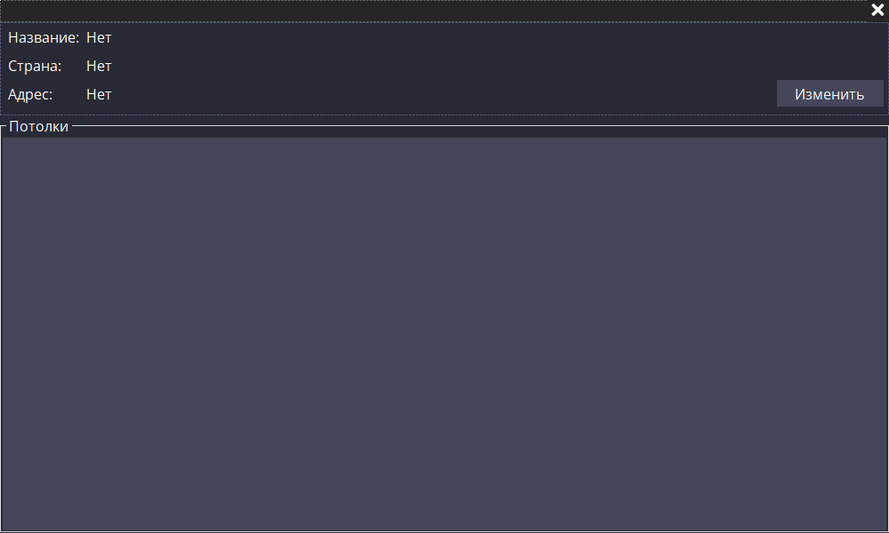

### 6.2 Форма изменения информации производителя

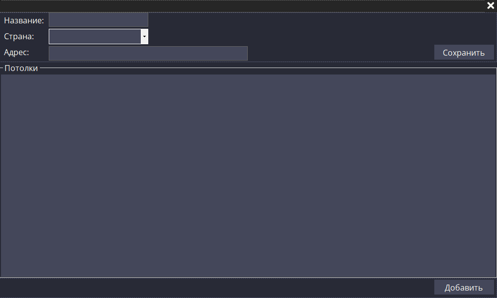

### 6.3 Форма просмотра информации потолка

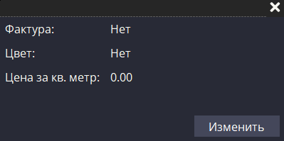

### 6.4 Форма изменения информации потолка

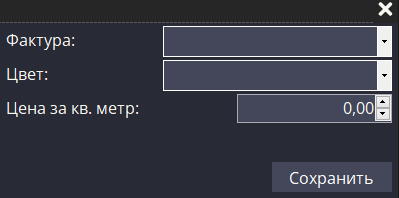

### 6.5 Форма взаимодействия со списком производителей

> **Добавлять/удалять** элементы из списка может только пользователь с правами на **добавление/удаления** производителя.

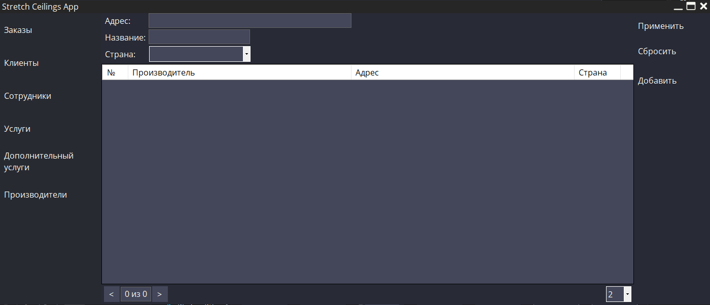

